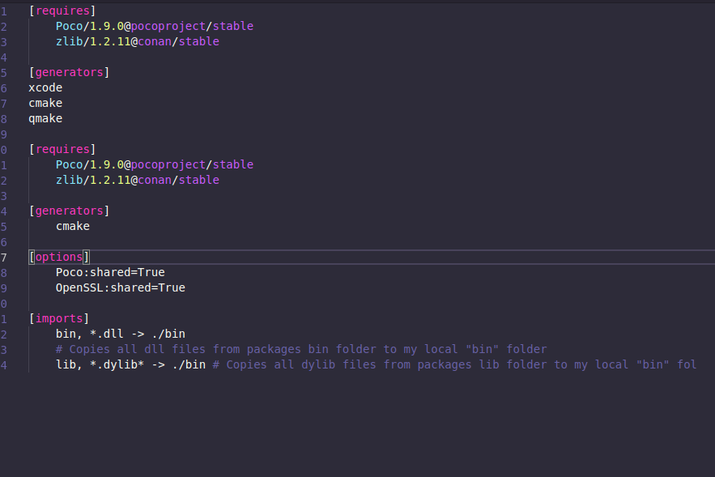

# conanlight README

Conanlight is a syntax highlighter for conanfile. Conanfile is used to manage dependencies for C/C++ projects.

Check it out in the extensions store here https://bit.ly/2xpJtg8

## Features

Highlight file with the name `conanfile.txt`

### 0.0.1

Initial release of conanlight

### 1.0.0

See CHANGELOG.md

**Enjoy!**
